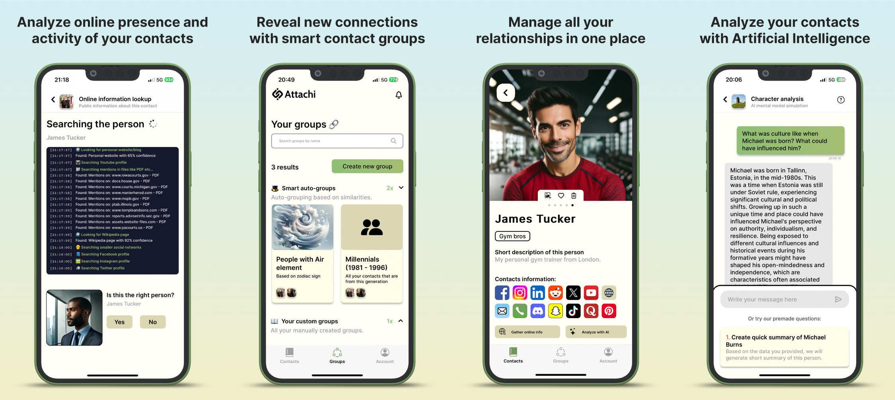

# Attachi


### What is Attachi
This app helps you to better understand your contacts and remember things you would normally forget or miss completely. How? Attachi simply gives you tools you need to reveal and organize information about people around you. Tracking online presence, auto-grouping based on similarities, or AI analysis of your contacts? We got you covered.





### What can Attachi do for you
Try smart auto-grouping of contacts based on similarity or create custom social groups to reveal connections between people. Answer pre-made questions about your contacts to get to know them better. Take advantage of our custom people search engine to reveal online mentions and activities of your contacts across social networks, online articles, and files like PDF or Word... Try AI features to analyse your contacts based on the information you provide to create detailed character profiles, briefings, personalised gift recommendations, and so much more.

### Thesis
To better understand the inner workings of this application in terms of its architecture, design, data encryption (GDPR) and implementation, please refer to the thesis PDF document in the "thesis" folder, where I explore the development process of this application in great detail.

### Run locally
Please remember that this project won't work without proper configuration of a new Firebase project and several other API keys.
Values that need to be configured for a local development are marked as <<*****************>>. If you really want to run this project
locally, instead of trying the released version, please follow README.md in the functions folder. There you will find more specific
instruction on how to configure new Firebase project..

### Online version:
Since the configuration process is rather complicated, you can try the final version of this application on:

Google Play Store: https://play.google.com/store/apps/details?id=cz.ojin.app

App Store: https://apps.apple.com/cz/app/attachi/id6449395592

Website: https://www.attachi.net/


### Build process:

```bash
# install dependencies
$ npm install

# serve with hot reload at localhost:3000
$ npm run dev

# build for production
$ npm run build

# generate static project
$ npm run generate

# To build Android icons/splash screens
$ npx @capacitor/assets generate --android

# Generate Android project
$ npm run build
$ npx cap sync
$ npx cap open android

# Generate IOS project
$ npm run build
$ npx cap sync
$ npx cap open ios
```


### Future development:
Please note that this repository will not receive any updates as it is for presentation purposes only. All files in this repo are a snapshot from the time of the thesis submission. Future updates of the application will be pushed to the original private repository.